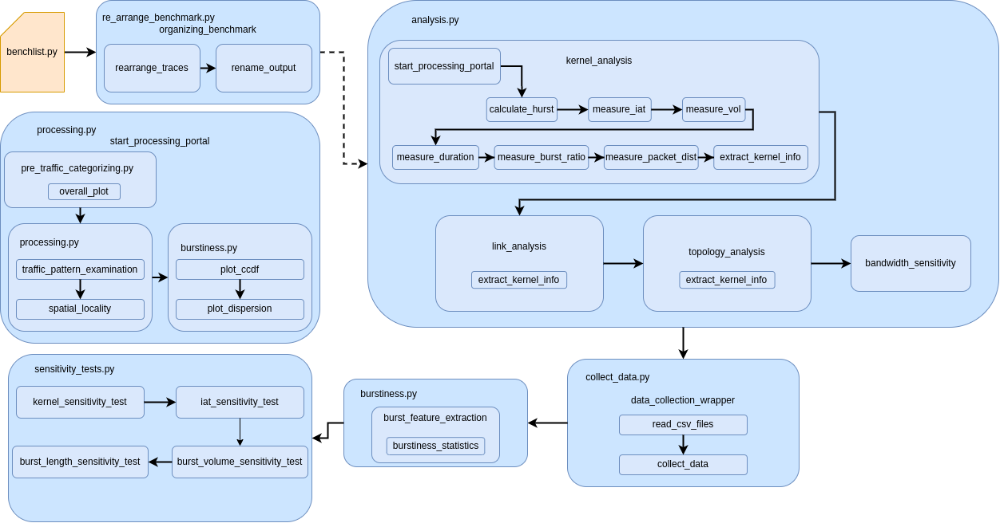

The post-processing data flow for GPU benchmarks.



The entire processing procedure starts from ```characterizing_benchmarks/main.py```. So, simply run below command:

```commandline
python3.8 chracterizing_benchmarks/main.py
```
